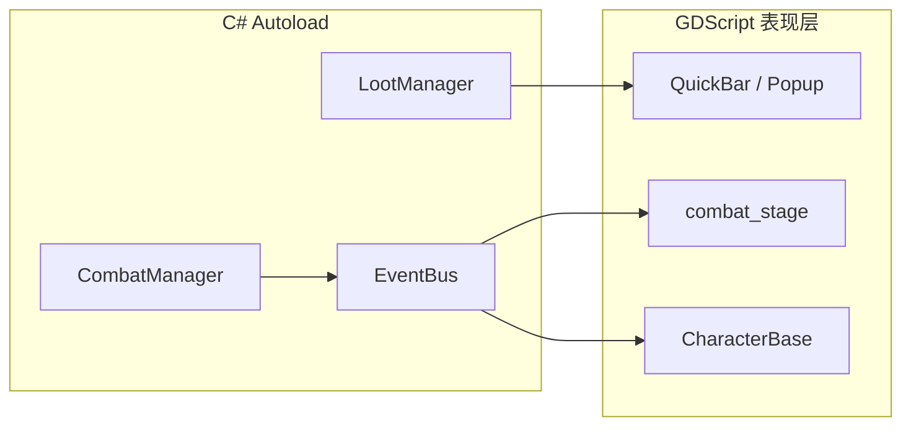

# 架构说明

## 双线闭环



- **C#**：战斗演算、掉落 RNG、Meta、存档；不继承 `Node2D`/`Control`，不向 GDScript 传递 Node 引用
- **GDScript**：UI、纸娃娃、VFX；通过 `connect("SignalName", ...)` 订阅 C# 信号
- **data/tables/**：唯一数值与编队配置源；禁止在 `_Ready` 硬编码假数据

## 四层 UI（400×150）

| Layer | 节点 | 职责 |
|-------|------|------|
| 0 | Background | 横向卷轴背景 |
| 1 | CombatStage | 上部 112px 战斗纸娃娃 |
| 2 | HUD | 顶部双血条 |
| 3 | QuickBar | 右下折叠菜单（18px / 30px） |

功能页为挂 `get_tree().root` 的独立 `Window`（640×480），`project.godot` 设 `embed_subwindows=false`。

## 信号约定

C# `[Signal]` 导出为 **PascalCase**。GDScript 连接示例：

```gdscript
event_bus.connect("PositionChanged", _on_position_changed)
event_bus.connect("UnitHpChanged", _on_unit_hp_changed)
event_bus.connect("CombatActionStarted", _on_combat_action_started)
```

## 模块边界

| 模块 | 允许 | 禁止 |
|------|------|------|
| CombatManager | 读 tables、发 EventBus | 创建/操作场景节点 |
| LootManager | 鉴定、分解、背包 API | UI 逻辑 |
| combat_stage | 订阅信号、驱动 VFX | 伤害公式、RNG |
| archive/ | 历史参考 | Autoload、scene 引用、编译 |

## 数据流

1. `EncounterTableLoader` 读 `data/tables/combat/` 初始化编队
2. `LootManager.InitializeNewGame()` 读 `data/tables/loot/new_game.json` 发放初始宝箱
3. `ItemGenerator.LoadEquipmentTemplates()` 读装备模板供鉴定 Roll
