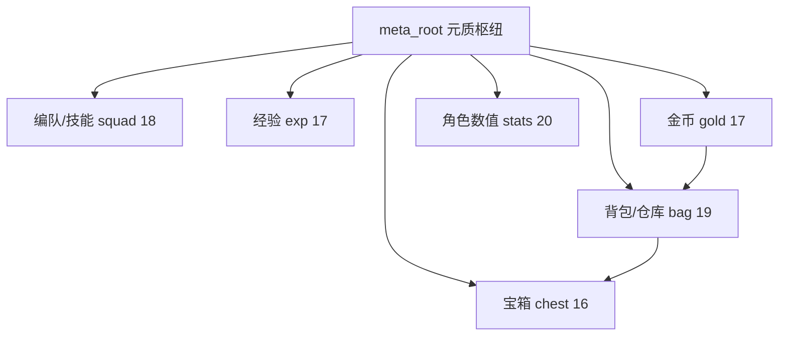

# 局外成长树（Meta Growth Tree）

配表：[`data/tables/meta/meta_growth_tree.json`](../data/tables/meta/meta_growth_tree.json)（113 节点）  
运行时：[`Scripts/Meta/DbManager.cs`](../Scripts/Meta/DbManager.cs)

## 六方向拓扑



| 方向 | 节点数 | 4h 里程碑 |
|------|--------|-----------|
| 编队/技能 | 18 | 三出战位 + 双主动 + 被动解锁 |
| 经验 | 17 | 击杀经验 +36%、分解 +50% |
| 金币 | 17 | 平金 +8、百分比 +16% |
| 背包/仓库 | 19 | 18→48 格、仓库、自动开箱 |
| 宝箱 | 16 | 掉落 +10%、待领上限 +6 |
| 数值 | 20 | 全属性养成见下表 |

## 金币整数公式

```
rawGold = baseGold + metaFlatGold
finalGold = Round(rawGold × (1 + metaGold% / 100) × rewardDecay × earlyBand × runBonus)
```

- **加法区**：`metaFlatGold`（方向 3 平金节点累加）
- **百分比区**：`metaGold%`（方向 3 百分比节点相加后一次乘算）
- **乘区**：关卡衰减、前期 band、奇境 run 加成（彼此相乘）
- **整数**：仅最终 `Round`

经验：`finalExp = rawExp × (1 + metaKillExp% / 100) × rewardDecay × …`

## 方向 1 经济 pacing（~4h 全清）

| 里程碑 | 节点 | 累计金 |
|--------|------|--------|
| 第二出战位 | br1_squad_02 | 280 |
| 第二主动槽 | br1_active_02 | 680 |
| 第三出战位 | br1_squad_03 | 1,480 |
| 被动解锁 | br1_passive_unlock | 2,380 |
| 方向 1 全清 | 18 节点 | ~9,800 |

## 方向 6 角色数值成长表（先锋 Lv1 基准）

| 节点组 | 单节点 | 累计 | Lv1 近似 |
|--------|--------|------|----------|
| 生命培育 ×5 | MaxHp +2% | +10% | 330 HP |
| 攻击锻造 ×5 | Damage +2% | +10% | 44 攻 |
| 铁壁 ×4 | Defense +3% | +12% | — |
| 迅捷 ×3 | AtkSpeed +2% | +6% | 2.54 |
| 致命 ×2 | CritRate +1% | +2% | 7% |
| 闪避 ×1 | Dodge +2% | +2% | 2% |
| 全能巅峰 | 全属性 +3% | +3% | HP 340 / 攻 45.4 |

## 初期上限

见 [`early_game_caps.json`](../data/tables/meta/early_game_caps.json)：

- 背包 **18** 格（养成最高 48）
- 待领宝箱/品质 **6**（养成最高 12）
- 出战 **1** 位、主动槽 **1**、被动 **锁定**

## UI

- **养成**弹窗：六分支 Tab + 星图
- **仓库**：养成→背包分支「打开仓库」，或 `PopupManager.WAREHOUSE`
