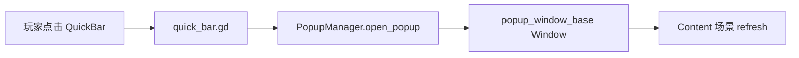
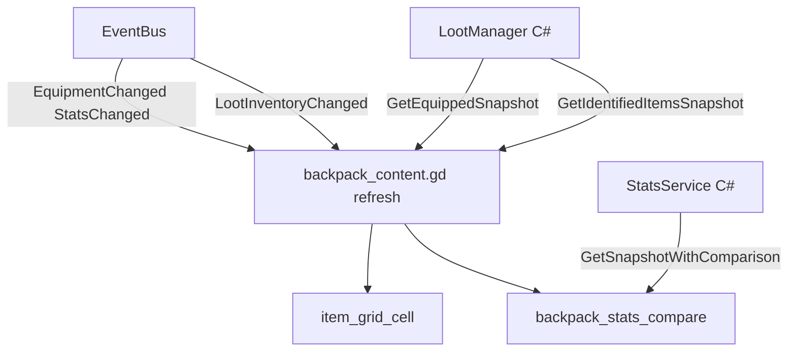
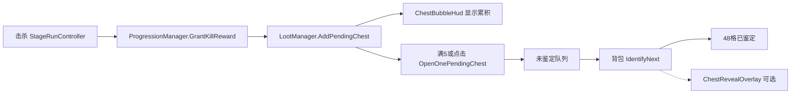

# UI 信息流

> **更新**：2026-06-02  
> 说明玩家可见信息从操作到数据源的路径。数值规则见 [`EQUIPMENT_LOOT_SNAPSHOT.md`](EQUIPMENT_LOOT_SNAPSHOT.md)；布局尺寸见 [`UI_SPEC.md`](UI_SPEC.md)。

---

## 1. 窗口与层级

| 层级 | 节点（`game_root.tscn`） | 尺寸 / 职责 |
|------|--------------------------|-------------|
| 0 | BackgroundLayer | 400×150 卷轴背景 |
| 1 | CombatStageLayer | 战斗纸娃娃、单位逻辑 X |
| 2 | HudLayer | 兜底血条等 |
| — | ChestBubbleHud | 左上待领宝箱气泡 |
| — | SkillCastOverlay | 技能 toast / 友方特写 |
| — | ChestRevealOverlay | 鉴定演出遮罩 |
| — | RunHud | 奇境 Run 状态 |
| 3 | StageProgressBar + QuickBarLayer | 波次条 + 右下菜单 |
| — | SettingsDockLayer | 左下「设置」 |
| — | PopupManager | 逻辑节点，不绘制 |
| 10 | GmToolsLayer | F8 GM 面板 |

**卫星窗**：`popup_window_base.tscn` → 挂 `root`，640×480，`embed_subwindows=false`。

---

## 2. 入口导航（QuickBar → Popup）

| PopupId | 窗口标题 | Content 场景 | 打开方式 |
|---------|----------|--------------|----------|
| BACKPACK | 背包 | `backpack_content.tscn` | QuickBar「背包」 |
| SQUAD | 编队 | `squad_content.tscn` | QuickBar「编队」 |
| CULTIVATION | 养成 | `cultivation_content.tscn` | QuickBar「养成」 |
| WONDERLAND | 奇境 | `wonderland_content.tscn` | 冒险▼「奇境 Run」 |
| STAGE_SELECT | 关卡 | `stage_select_content.tscn` | 冒险▼「训练关卡」 |
| CHARACTER_STATS | 详细属性 | `detailed_stats_content.tscn` | 背包「详细属性」 |
| SETTINGS | 设置 | `settings_content.tscn` | SettingsDock |
| RUN_CARD_PICK / RUN_RELIC_PICK | 选卡/选遗物 | 对应 content | Run 流程 C# 调用 |

文案表：`popup_manager.gd` 的 `POPUP_TITLES`；静态说明页另读 `popup_texts.json`。

---

## 3. 背包信息流（重点）

### 3.1 用户操作 → UI 反馈

| 操作 | 更新控件 | 文案来源 |
|------|----------|----------|
| 切换「当前查看」单位 | 纸娃娃、8 装备槽、属性对比、技能 Tab | `PartyManager` 显示名 + `UiLabelsLoader` 槽位全名 |
| 点击背包格 | `DetailLabel`、Tooltip、`StatsCompare` 装备提示 | `LootManager.GetIdentifiedItemsSnapshot` |
| 点击装备槽 | 详情「部位 xxx 空 / 已装备」 | 槽位全名 + `GetEquippedSnapshot` |
| 穿上 / 卸下 / 鉴定 / 分解 | 详情 + 全表 refresh | `LootManager` + `GetLastEquipError` |
| 拖拽 bag ↔ equip | 同穿上/卸下规则 | `item_grid_cell` + `EquipByBagIndex` |

### 3.2 数据流

### 3.3 订阅信号（`backpack_content._connect_event_bus`）

- `LootInventoryChanged` → `refresh()`
- `EquipmentChanged` → `refresh()`
- `StatsChanged` → `_refresh_stats_compare()`
- `SquadChanged` / `RosterLevelChanged` → `refresh()`

### 3.4 槽位与属性 Label 规范

- 装备槽显示名：`data/tables/ui/slot_labels.json` → `UiLabelsLoader.get_slot_display_name`
- 属性对比标题：`stat_labels.json` → `UiLabelsLoader.get_stat_display_name`（禁止 HP/DMG 等缩写 Label）

---

## 4. 战斗 ↔ 掉落 ↔ 宝箱 ↔ 鉴定

细节与概率表见 [`EQUIPMENT_LOOT_SNAPSHOT.md` §5](EQUIPMENT_LOOT_SNAPSHOT.md#5-开箱与鉴定规则)。

---

## 5. 其他弹窗（摘要）

| 弹窗 | 主要数据源 | 刷新触发 |
|------|------------|----------|
| 编队 | `PartyManager` bench/active、`DbManager` 槽位 | 按钮操作、`SquadChanged` |
| 技能 | `character_skill_trees.json`、`CharacterSkillManager` | `SkillsChanged`、Tab 切换 |
| 养成 | `db_tree.json`、`star_chart_tree.json` | 购买节点事件 |
| 奇境 | `RunSessionManager`、`popup_texts.json` | Run 状态信号 |
| 关卡 | `stage_catalog` + `StageProgressionManager` | 通关解锁 |
| 详细属性 | `StatsService.GetSnapshot` + `stat_labels.json` | `set_unit_id` / refresh |

---

## 6. GM / 设置 / 日志

| 功能 | 路径 | 输入 |
|------|------|------|
| GM 战斗面板 | `GmToolsLayer` layer 10 | F8；`popup_window_base` 子窗内转发 F8 |
| 设置坞 | `settings_dock` → SETTINGS 弹窗 | 左下按钮 |
| 日志窗 | `LogWindowManager` | 设置 → 工具 |
| 立绘 | `PortraitWindowManager` | 背包纸娃娃点击 |

GM 开关：`GameLogger.GetGmToolsEnabled()` ← `debug_settings.json`。

---

## 7. 文档索引

| 文档 | 用途 |
|------|------|
| [`UI_ASSET_WORKFLOW.md`](UI_ASSET_WORKFLOW.md) | 美术替换资产步骤与 manifest |
| [`UI_SPEC.md`](UI_SPEC.md) | 尺寸、密度、文案禁止简称 |
| [`EQUIPMENT_LOOT_SNAPSHOT.md`](EQUIPMENT_LOOT_SNAPSHOT.md) | 装备/开箱数值快照 |
